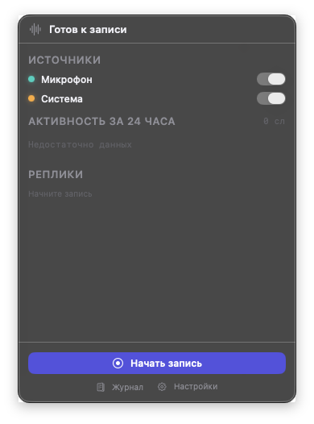
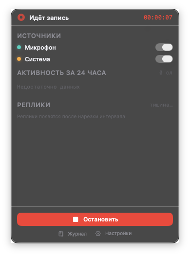
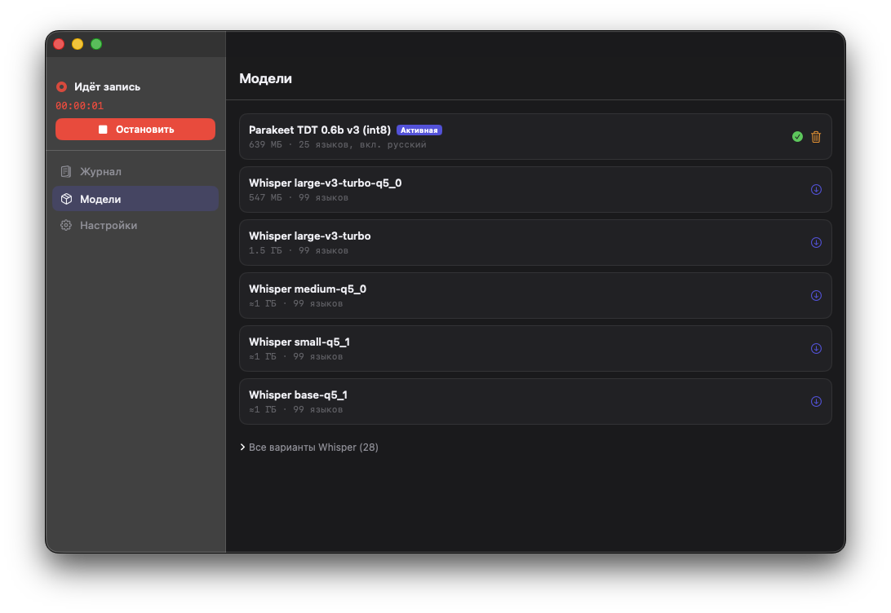

[English](README.md) · [Русский](README.ru.md)

# Chronica

Локальный сборщик контекста работы для macOS: непрерывно транскрибирует микрофон и системный звук прямо на устройстве и, если захотите, ведёт текстовый журнал того, чем вы занимались на экране.

[](https://github.com/Vadim170/chronica/actions/workflows/ci.yml)
[](LICENSE)
[](#требования)



> Интерфейс приложения локализован на **английский и русский** и следует языку системы. Документы в `docs/` — на русском; этот README и [README.md](README.md) — русская и английская точки входа.

## Что делает

- **Пишет две дорожки сразу** — микрофон (`mic`) и системный звук (`remote`: собеседник в звонке, видео, встреча) — и складывает результат в SQLite интервалами с временными метками.
- **Работает целиком на устройстве.** Аудио не покидает компьютер. Телеметрии, аналитики, отправки крешей и автообновления нет.
- **Необязательный журнал дел с экрана** (по умолчанию выключен): раз в период снимается кадр, локальная vision-модель в [Ollama](https://ollama.com) описывает, какая идёт работа, и сохраняется **только текст** — сами изображения не хранятся нигде.
- **Отдаёт данные обратно**: журнал с поиском в приложении, экспорт периода в JSON/Markdown, необязательный локальный HTTP API и бинарь `chronica`, который читает ту же базу без запущенного приложения.
- **Живёт в строке меню** фоновым агентом — без иконки в Dock и без окна, которое надо закрывать.

## Приватность

Коротко: всё обрабатывается и хранится на вашем Mac. Подробно — [`docs/PRIVACY.md`](docs/PRIVACY.md).

### Что уходит в сеть и когда

| Куда | Когда | Что именно |
|---|---|---|
| `huggingface.co` | Только когда вы нажали **Скачать** в разделе «Модели» | Веса ASR (Parakeet / Whisper) и файл Silero VAD на 1,8 МБ, по HTTPS, с проверкой sha256 там, где дайджест известен реестру |
| Ollama (по умолчанию `http://127.0.0.1:11434`) | Только пока включён журнал дел | Один HTTP-запрос на тик: уменьшенный JPEG экрана и короткий промпт. Адрес — свободное поле, см. предупреждение ниже |
| Локальный HTTP API (по умолчанию `127.0.0.1:8765`) | Только если вы включили его в настройках | Отдаёт ваши же данные вашей же машине. На непетлевом адресе без Bearer-токена сервер не стартует |
| Больше никуда | Никогда | Ни телеметрии, ни аналитики, ни отчётов о падениях, ни проверки обновлений, ни аккаунта |

> **Адрес Ollama выбираете вы — и отвечаете за него тоже вы.** По умолчанию это loopback, и ничего не валидируется: если вписать удалённый хост, скриншоты в base64 уедут туда по обычному HTTP.

### Что пишется на диск и куда

Всё лежит в `~/Library/Application Support/Chronica/`.

| Путь | Содержимое |
|---|---|
| `store/transcriber.sqlite` | Текст расшифровки по интервалам и каналам, границы интервалов, события голосовой активности |
| `store/screen.sqlite` | Журнал дел: имя приложения, заголовок окна, текстовое описание от модели, времена. **Изображений нет.** Хранится 90 дней по умолчанию |
| `store/logs/core.log` | Паники Rust и stderr нативных рантаймов — для разбора падений. Ротация на 2 МБ. Транскрипты сюда не пишутся |
| `Models/` | Скачанные веса ASR |

### Как удалить всё

```bash
# 1. Выйдите из Chronica через меню в строке меню.
rm -rf ~/Library/Application\ Support/Chronica     # базы, логи, модели
defaults delete io.github.vadim170.chronica        # настройки
defaults delete app.transcriber.mac                # настройки сборки до переименования
rm -rf /Applications/Chronica.app
# 2. Отзовите разрешения: Системные настройки → Конфиденциальность и безопасность →
#    Микрофон / Запись экрана и системного звука.
```

## Требования

- **macOS 14.0 и новее.** Захват системного звука использует Core Audio process tap, а он требует **macOS 14.4+**; на 14.0–14.3 работает фолбэк через ScreenCaptureKit.
- **Apple Silicon.** Релизы собираются только под `arm64`.
- **~640 МиБ на диске** под модель Parakeet по умолчанию (варианты Whisper — от десятков МиБ до ~1,5 ГиБ).
- **Оперативная память**: примерно 1,2–1,7 ГБ во время записи, пик около 2,6 ГБ на загрузке модели (замер на M4). В простое, с остановленной записью, агент держит ~50 МБ.
- Для журнала дел дополнительно нужна установленная и запущенная [Ollama](https://ollama.com).

## Установка

1. Скачайте `Chronica-<версия>.dmg` из [Releases](https://github.com/Vadim170/chronica/releases) и перетащите приложение в `/Applications`. **Сборка 0.1.0 подписана только ad-hoc и не нотаризована** — прежде чем запускать, прочитайте примечание ниже.
2. Запустите. Chronica появится в строке меню (иконки в Dock нет).
3. При первом запуске панель предлагает ровно одно действие: скачать модель по умолчанию — *Parakeet TDT 0.6b v3 (int8)* — с указанием размера и прогрессом загрузки. Файл Silero VAD приедет вместе с ней автоматически. Полный список моделей — в разделе **Модели**.
4. Нажмите кнопку записи. macOS спросит доступ к **микрофону**, а для дорожки системного звука — к **записи экрана и системного звука**. Если доступ к микрофону отклонён, панель покажет кнопку перехода в нужный раздел системных настроек, а не «замолчит».
5. Готово. В панели видна живая лента, в разделе **Журнал** — история.

> **О подписи 0.1.0.** Первый релиз подписан ad-hoc, а не сертификатом Developer ID, и не нотаризован Apple — подписанные и нотаризованные релизы появятся, когда сертификат будет готов. Из-за этого Gatekeeper блокирует первый запуск: в зависимости от версии macOS увидите «Chronica.app повреждено и не может быть открыто» либо «Apple не может проверить это приложение на наличие вредоносного ПО», а правый клик → «Открыть» на macOS 15+ это уже не обходит. Два разовых способа снять блокировку, когда приложение уже в `/Applications`:
>
> - **Через терминал:** `xattr -dr com.apple.quarantine /Applications/Chronica.app`, дальше запускайте обычным двойным кликом.
> - **Без терминала:** попробуйте открыть один раз (запуск не удастся), затем зайдите в **Системные настройки → Конфиденциальность и безопасность** и нажмите **«Открыть всё равно»** рядом со строкой про Chronica.
>
> Рядом с DMG на странице Releases лежит файл `.sha256`, чтобы свериться со скачанным файлом, а собрать приложение самостоятельно можно по [`docs/BUILD.md`](docs/BUILD.md).

Homebrew cask запланирован, но пока его нет. Встроенного апдейтера тоже нет — новые версии берутся из Releases.

**Обновляетесь со сборки до переименования** (приложение называлось *Transcriber*)? Bundle id сменился, поэтому macOS видит совершенно новое приложение: доступ к **микрофону** и к **записи экрана и системного звука** придётся выдать заново. Папка данных и настройки переносятся автоматически при первом запуске; устаревшую запись **Transcriber** в Системные настройки → Основные → Объекты входа нужно удалить руками.

## Интерфейс

| Идёт запись | Менеджер моделей |
|---|---|
|  |  |

Панель в строке меню — повседневная поверхность: состояние, два тумблера источников, график активности за 24 часа, живая лента и кнопка записи. За ней — одно окно с тремя разделами: **Журнал** (дела и расшифровка, с выбором периода, экспортом и поиском), **Модели** и **Настройки**; технические счётчики живут в отдельном окне **Диагностика**.

**Язык.** Интерфейс есть на английском и русском и следует языку системы — вместе с формами слов у чисел и локальными форматами даты и чисел. Если хочется держать Chronica на языке, отличном от системного: **Системные настройки → Основные → Язык и регион → Приложения**, добавить Chronica и выбрать язык. Журнал экрана просит локальную vision-модель описывать работу *на языке интерфейса*, поэтому журнал не наполняется записями на языке, который вы не читаете.

## Модели

Веса не входят в дистрибутив: приложение качает их по вашей команде в `~/Library/Application Support/Chronica/Models/`, докачивая прерванные файлы и проверяя sha256 там, где дайджест известен.

| Модель | На диске | Рантайм | Примечание |
|---|---|---|---|
| **Parakeet TDT 0.6b v3 (int8)** — по умолчанию | ~640 МиБ (4 файла) | sherpa-onnx | Мультиязычная, включая русский и английский. Язык определяется автоматически |
| Whisper `large-v3-turbo-q5_0` | ~547 МиБ | whisper.cpp (Metal) | Рекомендуемая альтернатива на Whisper |
| Whisper — всего 33 ggml-варианта | десятки МиБ … ~1,5 ГиБ | whisper.cpp (Metal) | `tiny`/`base`/`small`/`medium`/`large`, версии `.en` и квантованные |
| Silero VAD | 1,8 МБ | sherpa-onnx | В списке не показывается; ставится автоматически с любой ASR-моделью |

Смена модели требует перезапуска сессии записи — это делает кнопка **Применить**. Длина интервала, порог тишины, порог VAD и язык применяются на лету, без перезапуска.

## Журнал дел с экрана (необязательный)

По умолчанию выключен. Когда вы включаете его в настройках:

1. Раз в минуту (по умолчанию; на выбор 1 / 2 / 5 / 10 минут) снимается один кадр через ScreenCaptureKit, уменьшается примерно до 1024 pt и кодируется в JPEG.
2. 64-битный average hash сравнивается с предыдущим кадром. Если картинка не изменилась, а активное приложение и заголовок окна те же — vision-модель **не вызывается вовсе**, текущий блок дела просто продлевается.
3. Иначе JPEG уходит в Ollama на localhost, и модель возвращает одно-два предложения о том, какая идёт работа.
4. В `screen.sqlite` пишется только текст: имя приложения, заголовок окна, описание и времена — сам кадр удаляется сразу после запроса. Наблюдения сессионизируются в блоки дел со `start`/`end` и хранятся 90 дней по умолчанию (на выбор 30 / 90 / 180 дней или «Всегда»).
5. Тик пропускается целиком, пока экран заблокирован или пользователь бездействует дольше периода.

Подготовка:

```bash
brew install ollama          # или скачайте с ollama.com
ollama serve
ollama pull qwen3-vl:2b      # модель по умолчанию; подойдёт любая vision-модель Ollama
```

Имя модели и адрес Ollama — настройки. Лицензия самой модели действует для вас напрямую, см. [`THIRD_PARTY_NOTICES.md`](THIRD_PARTY_NOTICES.md).

## Локальный HTTP API и CLI

API **выключен по умолчанию**. После включения в настройках он слушает `127.0.0.1:8765`, заворачивает ответы в конверт `{ "ok": …, "data" | "error" }` (кроме «файловых», которые задуманы для сохранения как есть) и отказывается стартовать на непетлевом адресе без Bearer-токена. Эндпоинты покрывают состояние движка, интервалы, «сшитый» транскрипт, полнотекстовый поиск, бакеты голосовой активности и экспорт журнала; `GET /api/v1/openapi.json` отдаёт машиночитаемое описание. Полный справочник — [`docs/API.md`](docs/API.md) и [`docs/openapi.json`](docs/openapi.json).

```bash
curl -s -H "Authorization: Bearer $TOKEN" \
  "http://127.0.0.1:8765/api/v1/transcript?from=2026-09-03&to=2026-09-04"
```

`chronica` читает тот же файл SQLite и **не требует запущенного приложения** — удобно для скриптов и чтобы скормить день целиком языковой модели. Команды: `today`, `transcript`, `search`, `stats`, `export`, `db` (плюс `transcribe` в сборке с ML-рантаймом). Полный справочник — [`docs/DATA.md`](docs/DATA.md).

```bash
cd core && cargo build --release --bin chronica --no-default-features --features store
cp target/release/chronica /usr/local/bin/    # без ML-рантайма, dylib рядом не нужны
chronica today
```

## Архитектура

Движок — переиспользуемый Rust-крейт; платформенная оболочка только захватывает аудио, держит ML-рантаймы и рисует интерфейс.

```
  Оболочка macOS (SwiftUI + AppKit, агент в строке меню)
    микрофон ─ AVAudioEngine ──────────────┐
    системный звук ─ Core Audio tap (14.4+)│  push PCM (любой rate / число каналов)
                     либо ScreenCaptureKit
                                           ▼
  ┌──────────────── Ядро на Rust: transcriber-core ──────────────────────────┐
  │  ресемпл → 16 кГц моно                                                   │
  │  Silero VAD (откат на RMS, если весов нет)                               │
  │  нарезка интервалов: 30 с … 5 мин, рез в паузе тишины между словами      │
  │  ASR: Parakeet TDT 0.6b v3 int8 (sherpa-onnx) | Whisper (whisper.cpp)    │
  │  хранилище SQLite (+ индекс FTS5) · метрики · события                    │
  │  необязательный локальный HTTP API (loopback) · chronica по той же БД │
  └──────────────────────────────────────────────────────────────────────────┘
                                           │ события / метрики через UniFFI
                                           ▼
    панель: статус · тумблеры источников · активность за 24 ч · лента реплик · старт/стоп
            + шаги первого запуска (скачать модель, выдать доступ к микрофону)
    окно:   Журнал (Дела | Транскрипция, период, экспорт, поиск)
            Модели · Настройки (Основные · Журнал экрана · Дополнительно → Диагностика)

  необязательно, выключено по умолчанию — журнал дел с экрана (только macOS):
    кадр ScreenCaptureKit → average hash (неизменившийся кадр не идёт в модель)
      → vision-модель в Ollama на localhost → только текст → screen.sqlite
```

Ядро само не трогает микрофон: оболочка пушит PCM-кадры через `push_audio_frame`, а ядро ресемплит и обрабатывает. То же ядро через UniFFI Kotlin работает и в Android-клиенте — он экспериментальный, на устройстве не проверен и релизов не имеет.

## Сборка из исходников

Счастливый путь на Mac, где стоят Rust ≥ 1.80, Xcode 16+ / Swift 6 и `cmake`:

```bash
git clone https://github.com/Vadim170/chronica.git
cd chronica/apple
./Scripts/build-core.sh debug     # ядро + Swift-биндинги UniFFI + линковка
swift run Chronica             # запуск из терминала (dev)
./Scripts/install-debug.sh        # либо: собрать .app, подписать ad-hoc и запустить
```

Тесты:

```bash
cd core  && cargo test
cd apple && swift test
```

Поведенческие тесты ядра и приложения гоняются в CI на каждый push вместе с `rustfmt`, `clippy -D warnings` и линтом релизной обвязки.

Сборке нужна сеть: `sherpa-rs` скачивает предсобранные бинарники sherpa-onnx / ONNX Runtime, а `whisper-rs` собирает whisper.cpp через `cmake`. Чтобы собрать без единого ML-рантайма, используйте mock-ядро (`TRANSCRIBER_CORE_MOCK=1` вместе с `FEATURES=store,api,download,mock-asr,ffi`). Упаковка, подпись, нотаризация, фиче-флаги и типичные грабли — в [`docs/BUILD.md`](docs/BUILD.md).

## Структура репозитория

```
core/      Rust-крейт `transcriber-core` — движок, плюс бинарь `chronica`
apple/     macOS-приложение (SwiftUI + AppKit); Sources/, Tests/, Resources/, Scripts/
android/   Android-клиент на том же ядре — экспериментальный, в разработке: собирается из исходников, на устройстве не проверен, релизов нет
docs/      API.md · DATA.md · PRIVACY.md · BUILD.md · ROADMAP.md · STATUS.md · archive/
scripts/   check-versions.sh — держит три строки версии синхронными
.github/   CI и workflow подписанного релиза
```

**Поддержка платформ:** единственная платформа, которую Chronica поставляет и поддерживает, — macOS (см. «Требования» и «Установка» выше). Android — экспериментальный, в разработке: собирается из исходников и использует то же ядро, но на устройстве не проверен, релизов и гарантий нет. iOS — в планах, работа не начата.

`docs/STATUS.md` — инженерный журнал: длинный и честный насчёт того, что проверено, а что нет. В `docs/archive/` лежат устаревшие внутренние планы.

### Про имя

Раньше продукт назывался **Transcriber**; в 0.1.0 переименование доведено до всего, что видит пользователь: bundle id — `io.github.vadim170.chronica`, исполняемый файл — `Chronica`, папка данных — `~/Library/Application Support/Chronica/`. При первом запуске после обновления старая папка переносится одной операцией (на одном томе это переименование, поэтому 640 МиБ весов моделей не копируются), а настройки `pref.*` копируются из прежнего домена настроек. Если перенос сорвался, ничего не теряется: приложение продолжает работать со старой папкой и показывает ошибку.

Внутренние технические имена оставлены как были: крейт — `transcriber-core`, FFI-модуль — `transcriber_core` / `TranscriberCore`, файл базы — `transcriber.sqlite`. Их переименование пересоздало бы всю FFI-поверхность, ничего не меняя для пользователя.

## Сторонние компоненты и лицензии

Сама Chronica — под MIT, см. [`LICENSE`](LICENSE). Веса моделей с приложением не распространяются.

**Модель ASR по умолчанию требует атрибуции:** *Parakeet TDT 0.6b v3, © NVIDIA, лицензия [CC-BY-4.0](https://creativecommons.org/licenses/by/4.0/)* — [nvidia/parakeet-tdt-0.6b-v3](https://huggingface.co/nvidia/parakeet-tdt-0.6b-v3), качается из int8-экспорта для sherpa-onnx. Если вы распространяете Chronica вместе с этими весами или строите на них что-то своё, атрибуция едет с вами.

Всё остальное — ONNX Runtime, sherpa-onnx, whisper.cpp, ggml, Silero VAD, Rust-крейты, веса Whisper, Ollama и vision-модель — перечислено с лицензиями в [`THIRD_PARTY_NOTICES.md`](THIRD_PARTY_NOTICES.md).

## Участие · Безопасность · Лицензия

- Пул-реквесты приветствуются — ветки, гейты качества и ожидаемый стиль тестов описаны в [`CONTRIBUTING.md`](CONTRIBUTING.md).
- Нашли уязвимость? Сообщите приватно через GitHub Security Advisories, см. [`SECURITY.md`](SECURITY.md). Публичный issue для этого заводить не надо.
- Лицензия MIT. © 2026 Vadim Makarov.
